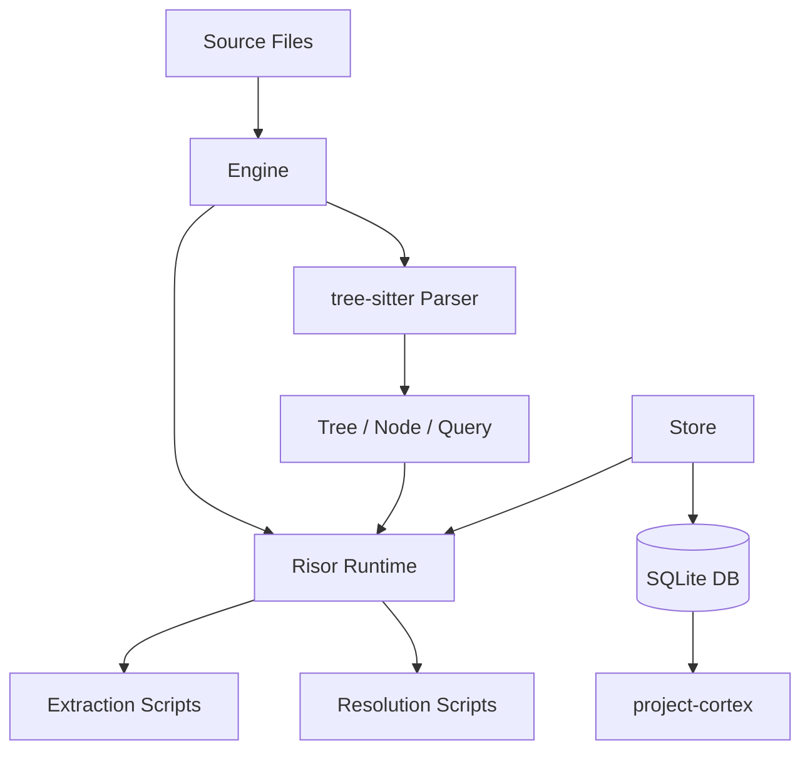

# System Components

## Architecture Overview



---

## Go Core

The Go layer is intentionally thin. It provides three things to Risor scripts: tree-sitter objects, the SQLite store, and orchestration. No wrappers, no abstractions over tree-sitter — the actual objects are passed through.

### Engine

Top-level orchestrator. Manages the pipeline: file discovery, change detection, tree-sitter parsing, Risor script execution, and database lifecycle. Exposes the public API that cortex imports.

**Responsibilities:**
- Initialize and manage the SQLite database (create, migrate, open)
- Detect changed files (hash comparison), skip unchanged
- Parse files with tree-sitter, pass Tree objects to extraction scripts
- Execute resolution scripts after extraction
- Expose query API for cortex

**Key methods:**
- `New(dbPath string, scriptsDir string, opts ...Option) (*Engine, error)`
- `IndexFiles(ctx context.Context, paths []string) error`
- `IndexDirectory(ctx context.Context, root string) error`
- `Resolve(ctx context.Context) error`
- `Query() *QueryBuilder`
- `Close() error`

### Store

SQLite data access layer for all 16 tables. Exposed directly to Risor scripts — scripts call methods on the Store object, no wrapper functions. Uses `database/sql` with `go-sqlite3` driver. WAL mode for concurrent reads.

See [interface.md](interface.md) for the full Store interface.

### Risor Runtime

Embeds Risor and executes scripts. The runtime is configured with globals that give scripts access to:
- `parse(path, language)` — parses a file with tree-sitter, returns the Tree object directly (scripts use tree-sitter's own query methods on the returned Tree/Node)
- `db` — the Store object, called directly (`db.InsertSymbol(...)`, `db.SymbolsByName(...)`)
- `log` — logging functions

Scripts receive real Go objects. Risor can call methods on them directly — that's why we chose Risor.

---

## Risor Scripts

All language-specific logic lives in Risor. Two categories of scripts:

### Extraction Scripts (`scripts/extract/`)

One per language. Receives a parsed tree-sitter Tree and the Store. Walks the CST (via direct tree-sitter API calls or S-expression queries) and writes to extraction tables.

Each extraction script:
1. Receives the Tree object for a file
2. Uses tree-sitter queries or node traversal to find declarations, references, imports, scopes
3. Writes symbols, scopes, references, imports, type_members, function_parameters, type_parameters, annotations, symbol_fragments to the Store

Script files:
- `scripts/extract/go.risor`
- `scripts/extract/typescript.risor`
- `scripts/extract/javascript.risor`
- `scripts/extract/python.risor`
- `scripts/extract/rust.risor`
- `scripts/extract/c.risor`
- `scripts/extract/cpp.risor`
- `scripts/extract/java.risor`
- `scripts/extract/php.risor`
- `scripts/extract/ruby.risor`

### Resolution Scripts (`scripts/resolve/`)

One per language. Queries extraction tables from the Store and writes to resolution tables. No tree-sitter access needed — operates purely on relational data.

Each resolution script:
1. Queries files, symbols, scopes, references, imports from the Store
2. Applies language-specific resolution logic (scope walking, import resolution, interface matching)
3. Writes resolved_references, implementations, call_graph, reexports, extension_bindings, type_compositions

Script files:
- `scripts/resolve/go.risor`
- `scripts/resolve/typescript.risor`
- `scripts/resolve/javascript.risor`
- `scripts/resolve/python.risor`
- `scripts/resolve/rust.risor`
- `scripts/resolve/c.risor`
- `scripts/resolve/cpp.risor`
- `scripts/resolve/java.risor`
- `scripts/resolve/php.risor`
- `scripts/resolve/ruby.risor`

### Shared Utilities (`scripts/lib/`)

Common Risor code shared across extraction and resolution scripts. Examples:
- Scope tree building utilities
- Common tree-sitter query patterns
- Visibility detection helpers

---

## Pipeline Flow

```
1. Engine detects changed files (hash comparison)
2. For each changed file:
   a. Engine parses file with tree-sitter → Tree object
   b. Engine looks up extraction script for the file's language
   c. Engine calls extraction script, passing (Tree, Store, file metadata)
   d. Extraction script walks CST, writes to extraction tables
   e. Tree object is released
3. Engine runs resolution scripts:
   a. For each language with extracted data, run the resolution script
   b. Resolution script queries extraction tables, writes resolution tables
4. project-cortex queries resolution tables for graph operations
```

---

## Testing Harness (Go)

### Oracle

Connects to real LSP servers at development time (not runtime) to get ground-truth semantic data. Used to verify extraction and resolution correctness and generate golden tests.

**Key methods:**
- `New(language string, config OracleConfig) (*Oracle, error)`
- `Definition(file string, line, col int) ([]Location, error)`
- `References(file string, line, col int) ([]Location, error)`
- `Implementations(file string, line, col int) ([]Location, error)`
- `Shutdown() error`

### Comparator

Diffs canopy output against oracle output. Produces accuracy reports (precision, recall, F1).

**Key methods:**
- `Compare(canopyResults, oracleResults []Location) *ComparisonReport`
- `CompareAll(ctx context.Context, files []string, engine *Engine, oracle *Oracle) *BulkReport`

### SnapshotRunner

Bulk snapshot testing against corpus files. Runs canopy on representative source files and compares against golden snapshots.

**Key methods:**
- `Run(ctx context.Context, corpusDir string) (*SnapshotReport, error)`
- `Update(ctx context.Context, corpusDir string) error`
